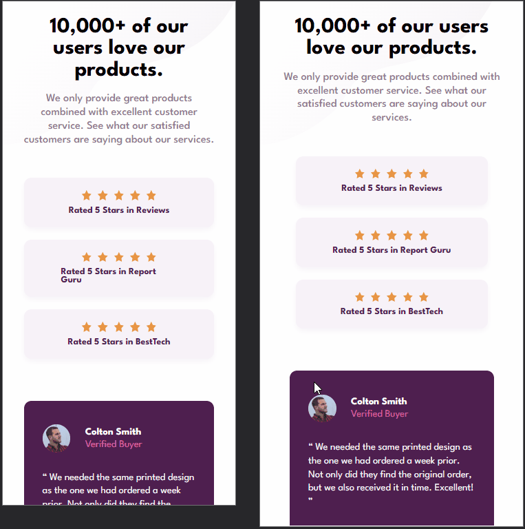
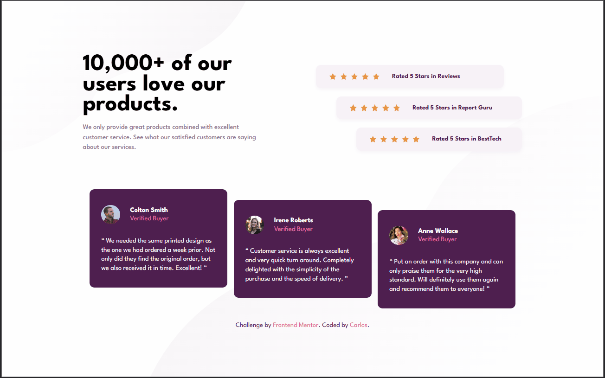

# Frontend Mentor - Social Proof Section

Esta é uma solução para o <a href="https://www.frontendmentor.io/challenges/social-proof-section-6e0qTv_bA" target="_blank" rel="noopener noreferrer">“Social Proof Section”</a>do **Frontend Mentor**. Os desafios do Frontend Mentor ajudam você a melhorar suas habilidades de codificação criando projetos realistas.

## 📑 índice

- [🔍 Visão Geral](#-visão-geral)
  - [🎯 O Desafio](#-o-desafio)
  - [📸 Screenshot](#-screenshot)
  - [🔗 Links](#-links)
- [🛠️ Meu Processo](#️-meu-processo)
  - [🏗️ Construído com](#️-construído-com)
  - [📘 O que eu aprendi](#-o-que-eu-aprendi)
  - [📚 Useful resources](#-useful-resources)
- [👤 Autor](#-autor)
- [📝 Licença](#-licença)
- [🙏 Agradecimentos](#-agradecimentos)

## 🔍 Visão Geral

### 🎯 O Desafio

Usuários devem ser capazes de:

- Visualizar o layout ideal da seção, dependendo do tamanho da tela do dispositivo.

### 📸 Screenshot

| 📱 Versão Mobile | 💻 Versão Desktop |
|------------------|-------------------|
|  |  |

### 🔗 Links

- 🔧 URL da solução: <a href="https://github.com/slayer-br/social-proof-section" target="_blank" rel="noopener noreferrer">Social Proof Section</a>  
- 🌐 URL do site ao vivo: <a href="https://slayer-br.github.io/social-proof-section" target="_blank" rel="noopener noreferrer">Social Proof Section</a>

## 🛠️ Meu Processo

### 🏗️ Construído com

- **HTML5 semântico**  
- **CSS3 com propriedades customizadas**
- **Flexbox**
- **CSS Grid** 
- **Workflow mobile-first**  
- **Google Fonts** (League Spartan)

### 📘 O que eu aprendi

Neste projeto aprendi a aplicar `box-shadow` com suavidade para destacar blocos, alinhar seções em grid e escalonar layouts com margens dinâmicas usando `margin-left` em breakpoints específicos.

```css
.rate-stars {
  background-color: var(--light-grayish-magenta);
  box-shadow: 0 4px 10px rgba(79, 27, 110, 0.05);
}
```

Também pude reforçar o uso de classes utilitárias com Flexbox e Grid em um layout responsivo e alinhado ao design de um mockup realista.

## 👤 Autor

- GitHub - <a href="https://github.com/slayer-br" target="_blank" rel="noopener noreferrer">@slayer-br</a>
- Frontend Mentor - <a href="https://www.frontendmentor.io/profile/slayer-br" target="_blank" rel="noopener noreferrer">@slayer-br</a>

## 📝 Licença

Este projeto está sob a licença [MIT](LICENSE), sinta-se livre para usar e modificar.

## 🙏 Agradecimentos

Agradeço ao time do **Frontend Mentor** pela estrutura dos desafios, que permite praticar com foco em pixel perfect e responsividade real.
